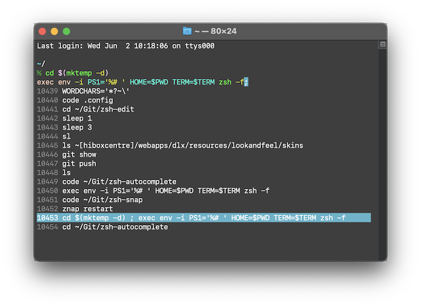

# `zsh-autocomplete`
`zsh-autocomplete` adds **real-time type-ahead autocompletion** to Zsh. Find as you type, then
press <kbd>Tab</kbd> to insert the top completion, <kbd>Shift</kbd><kbd>Tab</kbd> to insert the
bottom one, or <kbd>↓</kbd>/<kbd>PgDn</kbd> to select another completion.

[](https://asciinema.org/a/377611)

## Other Features
Besides live autocompletion, `zsh-autocomplete` comes with many other useful completion features.

### Optimized completion config
Zsh's completion system is powerful, but hard to configure. So, `zsh-autocomplete` does it for you,
while providing a manageable list of [settings](#settings) for changing the defaults.

### Live history search
Press <kbd>Control</kbd><kbd>R</kbd> or <kbd>Control</kbd><kbd>S</kbd> to do an interactive,
multi-line, fuzzy history search.

[](https://asciinema.org/a/379844)

### History menu
Press <kbd>↑</kbd> or <kbd>PgUp</kbd> to browse the last 16 history items. If the command line is
not empty, then it will instead list the 16 most recent fuzzy matches.



### Multi-selection
Press <kbd>Control</kbd><kbd>Space</kbd> in the completion menu or the history menu to insert more
than one item.


### Recent dirs completion
Works out of the box with zero configuration, but also supports `zsh-z`, `zoxide`, `z.lua`,
`rupa/z.sh`, `autojump` and `fasd`.


## Key Bindings
| Key(s) | Action | <sub>[Widget](#change-other-key-bindings)</sub> |
| --- | --- | --- |
| <kbd>Tab</kbd> | Accept top completion | <sub>`complete-word`</sub> |
| <kbd>Shift</kbd><kbd>Tab</kbd> | Accept bottom completion | <sub>`complete-word`</sub> |
| <kbd>Control</kbd><kbd>Space</kbd> | Show additional completions | <sub>`list-expand`</sub> |
| <kbd>↑</kbd> | Cursor up (if able) or history menu | <sub>`up-line-or-search`</sub> |
| <kbd>↓</kbd> | Cursor down (if able) or completion menu | <sub>`down-line-or-select`</sub> |
| <kbd>Alt</kbd><kbd>↑</kbd> | Cursor up (always) | <sub>`up-line`</sub> |
| <kbd>Alt</kbd><kbd>↓</kbd> | Cursor down (always) | <sub>`down-line`</sub> |
| <kbd>PgUp</kbd> | History menu (always) | <sub>`history-search`</sub> |
| <kbd>PgDn</kbd> | Completion menu (always) | <sub>`menu-select`</sub> |
| <kbd>Control</kbd><kbd>R</kbd> | Live history search, from newest to oldest | <sub>`history-incremental-search-backward`</sub> |
| <kbd>Control</kbd><kbd>S</kbd> | Live history search, from oldest to newest | <sub>`history-incremental-search-forward`</sub> |

### Completion Menu
| Key(s) | Action |
| --- | --- |
| <kbd>↑</kbd>/<kbd>↓</kbd>/<kbd>←</kbd>/<kbd>→</kbd> | Change selection |
| <kbd>Alt</kbd><kbd>↑</kbd> | Backward one group |
| <kbd>Alt</kbd><kbd>↓</kbd> | Forward one group |
| <kbd>PgUp</kbd>/<kbd>PgDn</kbd> | Page up/down |
| <kbd>Home</kbd>/<kbd>End</kbd> | Beginning/End of menu |
| <kbd>Control</kbd><kbd>Space</kbd> | Multi-select |
| <kbd>Tab</kbd> | Accept selection |
| <kbd>Shift</kbd><kbd>Tab</kbd> | Reject selection |
| <kbd>Enter</kbd> | Accept command line |

### History Menu
| Key(s) | Action |
| --- | --- |
| <kbd>↑</kbd>/<kbd>↓</kbd> | Change selection |
| <kbd>Home</kbd>/<kbd>End</kbd> | Beginning/End of menu |
| <kbd>Control</kbd><kbd>Space</kbd> | Multi-select |
| <kbd>←</kbd>/<kbd>→</kbd> | Accept selection & move cursor |
| <kbd>Tab</kbd> | Accept selection |
| <kbd>Shift</kbd><kbd>Tab</kbd> | Reject selection |
| <kbd>Enter</kbd> | Accept command line |

## Requirements
Recommended:
* **[Zsh](http://zsh.sourceforge.net) 5.8** or later.

Minimum:
* Zsh 5.3 or later.

## Installing & Updating
If you use [Znap](https://github.com/marlonrichert/zsh-snap), simply add the following to your
`.zshrc` file:
```zsh
znap source marlonrichert/zsh-autocomplete
```
To update, do
```zsh
% znap pull
```

### Manually
 1. Clone the repo:
    ```zsh
    % cd ~/Git  # or wherever you keep your Git repos/Zsh plugins
    % git clone --depth 1 -- https://github.com/marlonrichert/zsh-autocomplete.git
    ```
 1. Add to your `~/.zshrc` file, _before_ any calls to `compdef`:
    ```zsh
    source ~/Git/zsh-autocomplete/zsh-autocomplete.plugin.zsh
    ```
 1. Remove any calls to `compinit` from your `~/.zshrc` file.

Then, to update, do:
```zsh
% git -C ~zsh-autocomplete pull
```

### Other Frameworks/Plugin Managers
To install with another Zsh framework or plugin manager, please refer to your
framework's/plugin manager's documentation for instructions.

## Configuration
See the included [`.zshrc` file](.zshrc).

## Troubleshooting
Check out the latest development version:
```zsh
cd ~zsh-autocomplete; git switch main; git pull
```
Then restart your shell.

If that doesn't help, try deleting completion cache files:
```zsh
rm -rf $_comp_dumpfile $XDG_CACHE_HOME/zsh
```
Then restart your shell.

If that fails, try restarting Zsh without global config files:
```zsh
exec zsh -d
```

Failing that, try the steps in the [bug report template](.github/ISSUE_TEMPLATE/bug-report.md).

## Author
© 2020 [Marlon Richert](https://github.com/marlonrichert)

## License
This project is licensed under the MIT License. See the [LICENSE](LICENSE) file for details.
